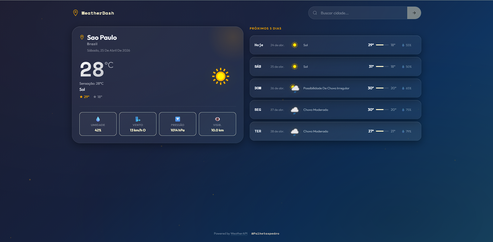
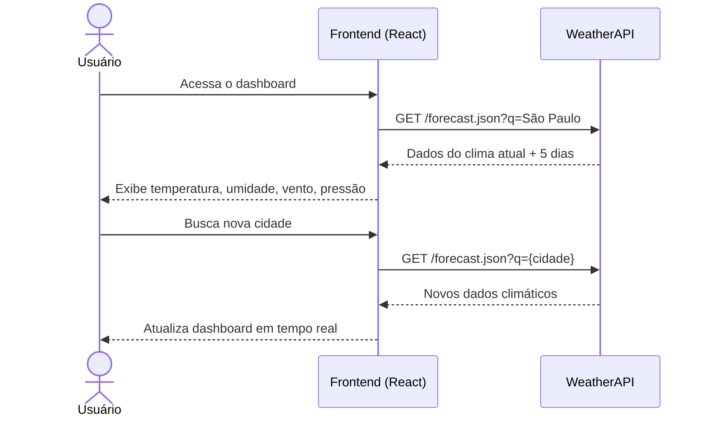
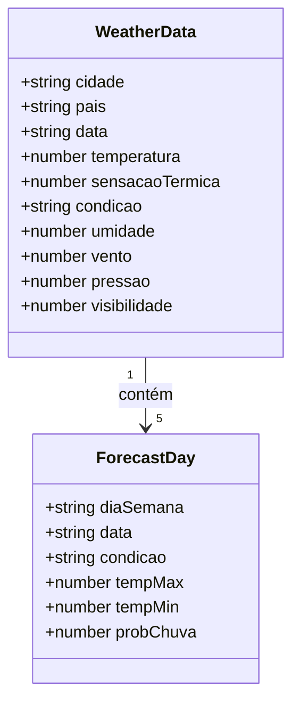

<div align="center">


#  WEATHERDASH
### Dashboard de Clima em Tempo Real

[](https://reactjs.org/)
[](https://vitejs.dev/)
[](https://nodejs.org/)
[](https://www.weatherapi.com/)
[](https://vercel.com/)

**Dashboard meteorológico que consome a WeatherAPI em tempo real.**  
Pesquise qualquer cidade do mundo e visualize temperatura, umidade, vento, pressão e previsão para os próximos 5 dias.

[ Ver Demo ao Vivo](https://weather-system-api.vercel.app/)

</div>

---

##  Capturas de Tela

### Dashboard Principal


---

##  Sobre o Projeto

O **WeatherDash** é um dashboard meteorológico desenvolvido com React e integrado à **WeatherAPI**, uma das APIs de clima mais completas do mundo.

O usuário acessa a interface, busca qualquer cidade do mundo e visualiza instantaneamente as condições climáticas atuais com previsão detalhada para os próximos 5 dias — tudo com uma UI elegante em dark mode.

---

##  Funcionalidades

-  **Busca global** — pesquise qualquer cidade do mundo
-  **Temperatura atual** com sensação térmica
-  **Condição do tempo** com ícone dinâmico
-  **Umidade** em porcentagem
-  **Velocidade do vento** em km/h
-  **Pressão atmosférica** em hPa
-  **Visibilidade** em km
-  **Previsão para os próximos 5 dias** com máximas, mínimas e probabilidade de chuva
-  **Suporte a qualquer cidade do mundo**
-  **Dark mode** por padrão

---

##  Arquitetura

```
WEATHERDASH
├── Frontend (React + Vite)  →  Vercel
│   ├── SearchBar       — Busca de cidades
│   ├── WeatherCard     — Card com clima atual
│   ├── WeatherDetails  — Umidade, vento, pressão e visibilidade
│   └── ForecastList    — Previsão dos próximos 5 dias
│
└── WeatherAPI (Externa)
    └── GET /forecast.json
        ├── current     — Clima atual
        └── forecast    — Previsão de 5 dias
```

---

##  Diagrama UML

### Fluxo da Aplicação



### Estrutura de Dados



---

##  Stack Tecnológica

| Camada | Tecnologia | Função |
|--------|-----------|--------|
| Frontend | React + Vite | Interface do usuário |
| Estilização | CSS Modules | Dark theme customizado |
| API Externa | WeatherAPI | Dados meteorológicos em tempo real |
| Deploy | Vercel | Hospedagem do frontend |

---

##  Como Rodar Localmente

### Pré-requisitos
- Node.js 18+
- Chave de API gratuita em [weatherapi.com](https://www.weatherapi.com/)

### Instalação

```bash
# Clone o repositório
git clone https://github.com/seu-usuario/weatherdash.git

# Entre na pasta do projeto
cd weatherdash

# Instale as dependências
npm install

# Configure as variáveis de ambiente
cp .env.example .env
# Adicione sua chave da WeatherAPI no .env

# Rode o projeto
npm run dev
```

### Variáveis de Ambiente

```env
VITE_WEATHER_API_KEY=sua_chave_aqui
```

> Crie sua chave gratuitamente em [weatherapi.com](https://www.weatherapi.com/) — o plano gratuito permite até 1 milhão de requisições/mês.

---

##  Exemplos de Cidades

Você pode buscar qualquer cidade do mundo, por exemplo:

- `São Paulo` → Brasil
- `Tokyo` → Japão
- `New York` → Estados Unidos
- `Paris` → França
- `Dubai` → Emirados Árabes

---

##  Estrutura de Pastas

```
weatherdash/
├── src/
│   ├── components/
│   │   ├── SearchBar.jsx
│   │   ├── WeatherCard.jsx
│   │   ├── WeatherDetails.jsx
│   │   └── ForecastList.jsx
│   ├── services/
│   │   └── weatherService.js   # Integração com a WeatherAPI
│   ├── styles/
│   │   └── global.css
│   └── App.jsx
├── .env.example
└── vite.config.js
```

---

##  Autor

<div align="center">

**Pedro Palheta**  
Desenvolvedor Full Stack

[](https://www.linkedin.com/in/pedro-palheta-b81017321/)
[](https://github.com/Palhetaspedro)

</div>

---

<div align="center">
  <sub>Desenvolvido com 🖤 e ☁️ por Pedro Palheta · Powered by <a href="https://www.weatherapi.com/">WeatherAPI</a></sub>
</div>
